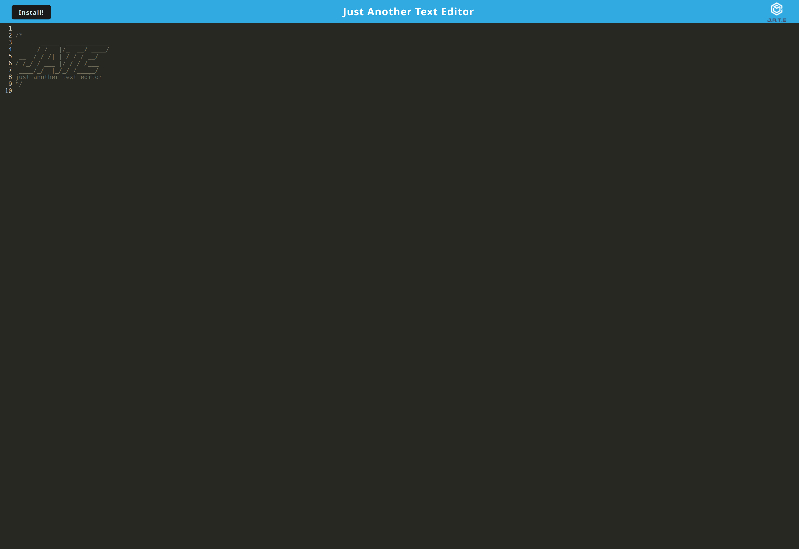

# JATE Text Editor

## Description
This is a simple text editor. I began with frontend code that styled the application and gave the editor most of its function but configured it to work as a Progressive Web Application (PWA) with webpack, gave it a persistent database to save and reload a user's entries to the editor with the IndexedDB database, and made it installable! This project helped to familiarize myself with PWAs, deploying them to Heroku, and learning to run Heroku from a dev environment when my initial build failed!

### Languages and Technologies
JavaScript, Node.js, Express, Webpack, IndexedDB
## Table of Contents
- [Installation](#installation)
- [Usage](#usage)
- [Screenshots](#screenshots)
- [Credits](#credits)
- [Deployed Application](#link)
    
## Installation
- Clone git repository
- Right click repository folder and select `Open in Integrated Terminal`
- To complete installation, run the command `npm run install`.

## Usage
- To launch the application locally, run the command `npm run start` or `npm run start` and navigate to http://localhost:3000/ in the browser. Alternatively, you can use the live deployment below without any installation required!
- Use as a simple text editor! Your entries will be saved for further visits.
- To install the application, simply click the install button and click `install` in the alert. It can be accessed via the desktop this way. Regardless of where you use JATE, it will run offline and online!

## Screenshots

## Credits
[Starter Code](https://github.com/coding-boot-camp/cautious-meme)

## Link to Deployed Page

[Live Page](https://powerful-refuge-08388-9a04dc55601c.herokuapp.com/)

---
